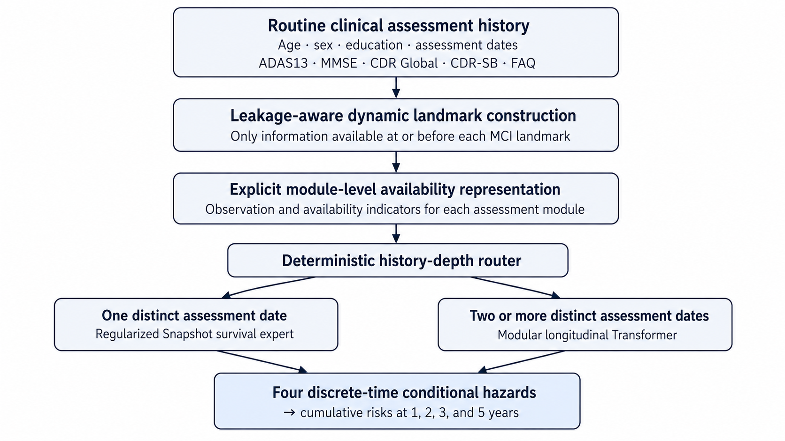

# Dynamic MCI-to-AD Risk Prediction Using Routine Clinical Assessments

[](https://github.com/rey-Lii/mci-ad-risk-assessment/actions/workflows/tests.yml)

**A hybrid clinical-AI system for single-date and longitudinal patient histories, developed on ADNI and externally evaluated on NACC.**

[Open the model-backed research demo](https://huggingface.co/spaces/reylii/MCI-to-Alzheimers-Dementia-Risk-Assessment)

> **Research use only.** Not for clinical use. Do not enter real patient information.

---

## Overview

This repository presents an externally evaluated pipeline for dynamic 1-, 2-, 3-, and 5-year prediction of progression from mild cognitive impairment (MCI) to Alzheimer’s disease dementia.

Clinical histories vary across healthcare settings. Some patients have only one assessment date, while others have repeated but irregular follow-up. Cognitive and functional assessments may also be missing or unavailable across patients and cohorts, particularly in primary-care, community, and resource-limited settings.

Rather than forcing every patient through one sequence model, the system uses deterministic history-based routing:

- **one distinct assessment date** → regularized Snapshot survival expert;
- **two or more distinct assessment dates** → modular longitudinal Transformer.

Both branches use explicit module-availability information. The longitudinal branch additionally models the five cognitive and functional assessments as separate temporal modules.

The system uses routine clinical information without requiring PET, CSF, MRI, or genetic testing.

<p align="center">
  
</p>

---


## Results at a glance

| Evaluation | Cohort | Participants | Dynamic landmarks | AUROC range |
|---|---|---:|---:|---:|
| Internal development evaluation | ADNI | 1,425 | 4,223 | 0.815–0.887 |
| Frozen zero-shot external evaluation | NACC | 12,052 | 26,303 | 0.719–0.778 |

The NACC evaluation comprised **8,817 Snapshot-route landmarks** and **17,486 longitudinal-route landmarks**. Because compatible ADAS13 measurements were unavailable in the prepared NACC cohort, the primary external evaluation followed the prespecified **no-ADAS13** scenario. IPCW was used to account for right censoring.

### Horizon-specific performance

| Horizon | ADNI AUROC | ADNI AUPRC | ADNI Brier | NACC AUROC | NACC AUPRC | NACC Brier |
|---|---:|---:|---:|---:|---:|---:|
| 1 year | 0.815 | 0.332 | 0.0869 | 0.719 | 0.123 | 0.0556 |
| 2 years | 0.844 | 0.641 | 0.1366 | 0.733 | 0.441 | 0.1756 |
| 3 years | 0.861 | 0.761 | 0.1463 | 0.759 | 0.619 | 0.2042 |
| 5 years | 0.887 | 0.877 | 0.1378 | 0.778 | 0.762 | 0.2024 |

The frozen ADNI-trained system was evaluated on NACC without retraining, feature revision, hyperparameter reselection, or external recalibration. These zero-shot predictions remain the primary external-validation results.

In a separate cross-fitted recalibration analysis, the mean absolute calibration gap decreased from **0.0666** to **0.0268** with intercept-only recalibration and to **0.0340** with intercept-and-slope recalibration; the underlying prediction models remained frozen.

---

## Data and variables

Raw ADNI and NACC participant-level data are not redistributed.

### Demographic information

- age;
- sex;
- education.

### Cognitive and functional assessments

Five assessment modules are modeled separately:

- ADAS13;
- MMSE;
- global Clinical Dementia Rating;
- Clinical Dementia Rating Sum of Boxes;
- Functional Activities Questionnaire.

The longitudinal representation additionally includes:

- assessment timing;
- irregular follow-up intervals;
- recency information;
- module-level missingness and availability indicators;
- module-local trajectory summaries.

---

## Method overview

### Longitudinal data engineering

Heterogeneous ADNI and NACC records were standardized into canonical longitudinal tables, with explicit checks for variable definitions, visit timing, assessment consistency, and cohort-specific availability.

Each eligible MCI assessment was treated as a dynamic prediction landmark. Only information available at or before that landmark was used, and all landmarks from the same participant were kept within a single evaluation partition to prevent participant overlap across partitions.

### Snapshot branch

The Snapshot branch uses a regularized discrete-time survival model for histories with one distinct assessment date.

A single assessment date does not support genuine trajectory features such as change, slope, visit gaps, recency across visits, or history span. The simpler branch therefore uses the latest available demographic and assessment state together with explicit missingness and availability indicators.

### Longitudinal branch

For histories with two or more distinct assessment dates, the longitudinal branch represents each cognitive and functional assessment as a separate temporal module.

The model distinguishes among observed measurements, missing measurements, and unavailable modules. Module-specific histories incorporate timing, gaps, recency, and local trajectory summaries before cross-module fusion.

During development, the longitudinal model was exposed to natural availability patterns and predefined reduced-assessment scenarios, including leave-one-module-out, no-ADAS13, MMSE-plus-CDR, and MMSE-only settings.

### Survival output

Both branches estimate four discrete-time conditional hazards:

- 0–1 years;
- 1–2 years;
- 2–3 years;
- 3–5 years.

These hazards are converted into nondecreasing cumulative risks at 1, 2, 3, and 5 years.

---

## Research demo

The hosted Hugging Face Space provides model-backed inference:

[Launch the interactive demo](https://huggingface.co/spaces/reylii/MCI-to-Alzheimers-Dementia-Risk-Assessment)

The interface accepts demographic information, cognitive and functional assessments, and assessment dates, then automatically selects the appropriate prediction branch.

The hosted demo uses a separately deployed frozen artifact bundle. Fitted preprocessors and model weights are not redistributed in this compact public repository.

---

## Local source-level validation

```bash
git clone https://github.com/rey-Lii/mci-ad-risk-assessment.git
cd mci-ad-risk-assessment

pip install -e ".[test]"

pytest
python examples/quickstart.py
```

The public validation suite checks:

- patient-input contracts and date normalization;
- temporal tensor construction;
- module observation and availability masks;
- deterministic route selection;
- hazard-to-risk conversion;
- monotonic cumulative-risk outputs.

The synthetic quickstart demonstrates the public model contracts without returning artificial or hard-coded patient risks.

---

## Contact

**Qirui Li**  
GitHub: [rey-Lii](https://github.com/rey-Lii)  
Email: liqirui019@gmail.com
